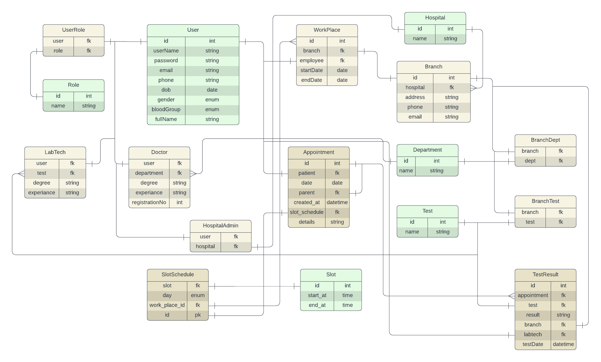

# Healthcare Management System (HMS)

The Healthcare Management System (HMS) is a comprehensive platform designed to streamline healthcare operations, enabling efficient management of appointments, prescriptions, and patient records for hospitals and clinics.

---

## Tech Stack

| Backend         | Database | ORM         | DB Migration | Frontend         | Platform |
|-----------------|----------|-------------|--------------|------------------|----------|
| FastAPI (Python)| MySQL    | SQLAlchemy  | Alembic      | ReactJS (JS)     | Docker   |

---

## Features

- **Patient Management:** Patients can book appointments and view their medical history.
- **Doctor Portal:** Doctors can access patient records and review previous appointments.
- **Appointment Scheduling:** Streamlined process for booking and managing appointments.
- **Prescription & Test Records:** View and manage prescriptions and test results associated with appointments.
- **Role-Based Access:** Secure access for different user roles (patients, doctors, admins).

---

## Entity Relationship Diagram



---

## Getting Started

### Prerequisites
- [Docker](https://www.docker.com/)
- [Docker Compose](https://docs.docker.com/compose/)

### Setup & Run
1. Clone the repository:
   ```bash
   git clone https://github.com/rhs99/hms.git
   cd hms
   ```
2. Start the application using Docker Compose:
   ```bash
   docker-compose up -d
   ```
3. Access the frontend at `http://localhost:3000` and the backend API at `http://localhost:5000/docs`

---

## Contributing

Contributions are welcome! Please open issues or submit pull requests for improvements and bug fixes.
