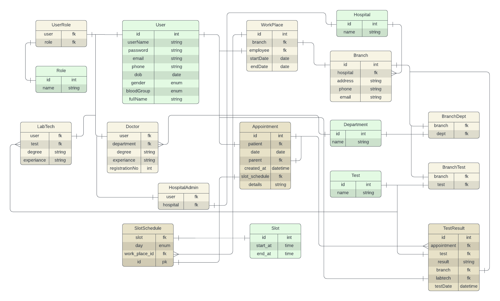

# Healthcare Management System

## Tech stack
<table>
<tr>
<th>Backend</th>
<th>Database</th>
<th>ORM</th>
<th>DB Migration</th>
<th>Frontend</th>
<th>Platform</th>
</tr>
<tr>
<td>FastAPI(Python)</td>
<td>MySQL</td>
<td>SQLAlchemy</td>
<td>Alembic</td>
<td>ReactJS(JavaScript)</td>
<td>Docker</td>
</tr>
</table>

## Key Features
- Patient can make appointment
- Doctor can check patient's previous appointments
- All the appointments and the respective prescriptions and tests can be viewed

## Entity Relationship Diagram
